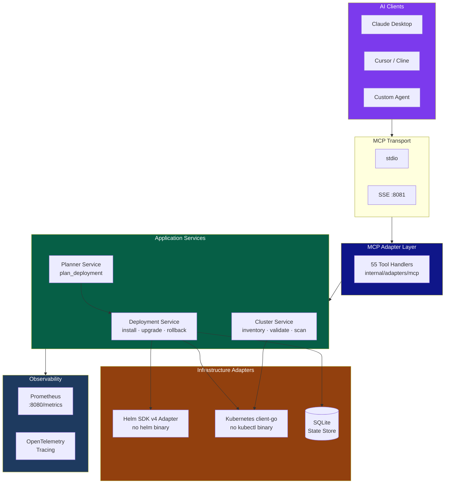
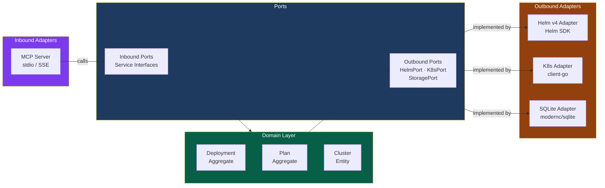
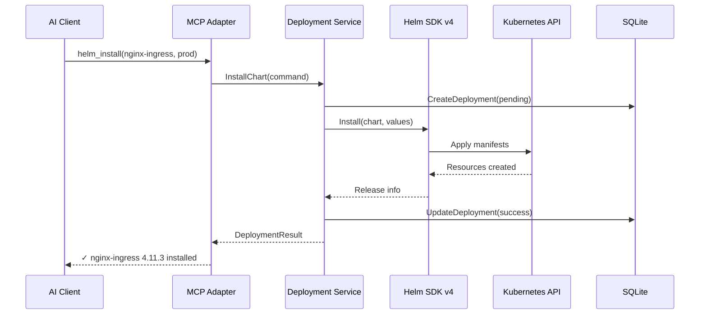
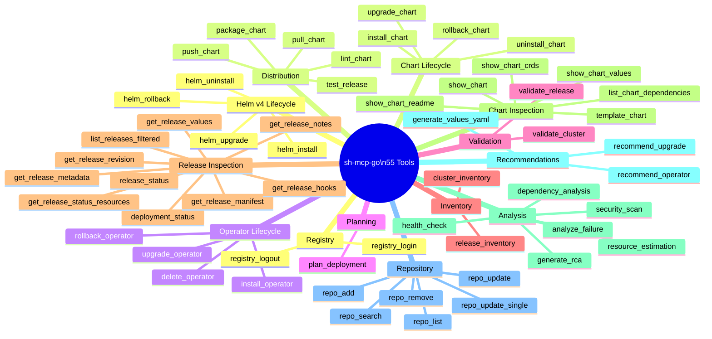
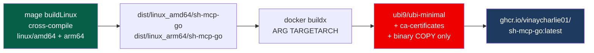
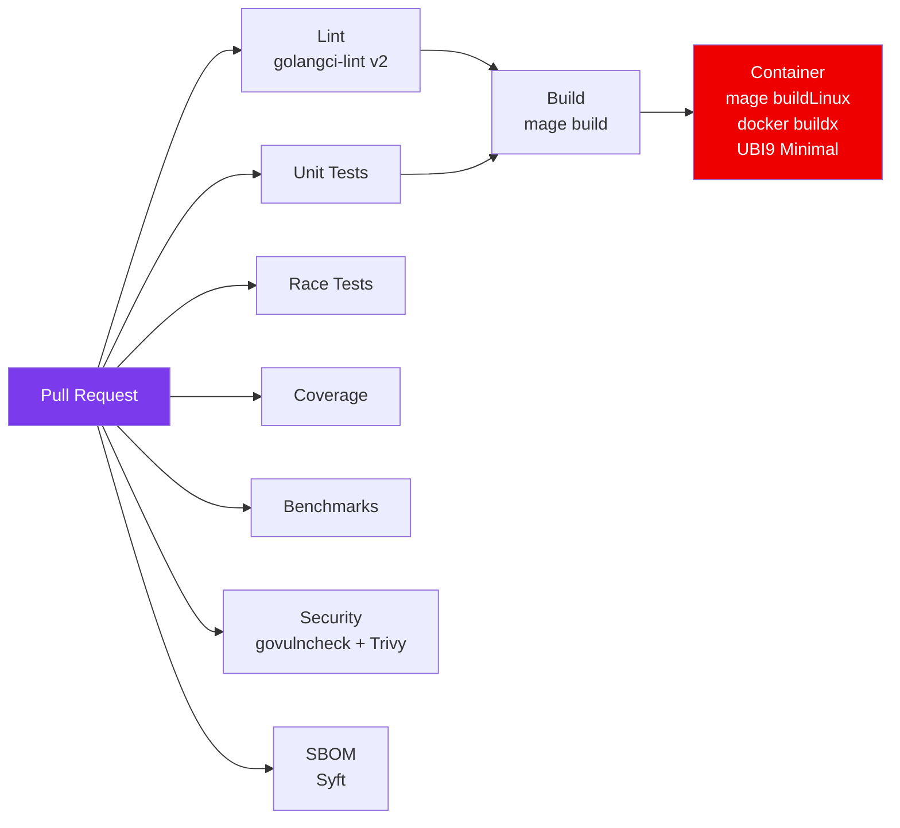

<div align="center">


# sh-mcp-go

**AI-Native Kubernetes Deployment Orchestrator via Model Context Protocol**

[](https://go.dev)
[](https://modelcontextprotocol.io)
[](LICENSE)
[](https://ghcr.io/vinaycharlie01/sh-mcp-go)
[](https://helm.sh)
[](https://kubernetes.io)

> *Deploy to Kubernetes by talking to your AI. No scripts. No pipelines. Just conversation.*

[Quick Start](#-quick-start) · [Architecture](#-architecture) · [55 MCP Tools](#-mcp-tools) · [Configuration](#-configuration) · [Docker](#-container) · [Development](#-development)

</div>

---

## What is sh-mcp-go?

`sh-mcp-go` turns any [MCP-compatible AI client](https://modelcontextprotocol.io) — Claude Desktop, Cursor, Cline, or your own agent — into a full Kubernetes deployment operator.

The AI calls **55 purpose-built MCP tools** to install Helm charts, upgrade operators, roll back failed releases, run root-cause analysis, scan for security misconfigurations, and estimate resource requirements — all without leaving the chat window and without a single shell script.

```
You: "Deploy nginx-ingress to the prod cluster, wait for it to be healthy,
      then check if we need to upgrade cert-manager."

AI:  plan_deployment → helm_install → health_check → recommend_upgrade
     ✓ nginx-ingress 4.11.3 installed (3 replicas, healthy)
     ✓ cert-manager 1.14.2 → upgrade to 1.17.0 recommended (3 CVEs fixed)
```

---

## Features

| | |
|---|---|
| **55 MCP Tools** | Full deployment lifecycle: install, upgrade, rollback, uninstall, health-check, RCA, resource estimation, dependency analysis, security scan, chart inspection, registry ops, and more |
| **Helm SDK v4** | Pure Go — no `helm` or `kubectl` binary required. Uses `helm.sh/helm/v4` and `client-go` directly |
| **AI Planning** | `plan_deployment` converts natural language into an ordered, dependency-aware step graph |
| **Server-Side Apply** | Native SSA support on install, upgrade, and rollback with field-ownership and conflict resolution |
| **Dual Transport** | stdio (local AI clients) and SSE (remote/web clients) |
| **Observability** | Prometheus metrics + OpenTelemetry tracing built in |
| **State Tracking** | SQLite-backed deployment history — lightweight, zero-dependency |
| **Multi-platform** | linux/amd64 and linux/arm64 container images on Red Hat UBI9 Minimal |

---

## Architecture

### System Overview



### Hexagonal Architecture



### Deployment Flow



---

## Quick Start

### Prerequisites

| Requirement | Version |
|-------------|---------|
| Go | 1.26+ |
| Kubernetes cluster | 1.28+ |
| `~/.kube/config` | pointing at your cluster |

### Build and Run

```bash
# Clone
git clone https://github.com/vinaycharlie01/sh-mcp-go
cd sh-mcp-go

# Install mage (one-time)
go install github.com/magefile/mage@latest

# Build
mage build

# Run (stdio mode — for Claude Desktop)
./dist/sh-mcp-go
```

### Claude Desktop Integration

Add to `~/Library/Application Support/Claude/claude_desktop_config.json` (macOS) or `%APPDATA%\Claude\claude_desktop_config.json` (Windows):

```json
{
  "mcpServers": {
    "sh-mcp-go": {
      "command": "/usr/local/bin/sh-mcp-go",
      "args": [],
      "env": {
        "KUBECONFIG": "/home/user/.kube/config"
      }
    }
  }
}
```

Restart Claude Desktop. The `sh-mcp-go` tool set will appear in the MCP tool panel.

See [`examples/claude-desktop.json`](examples/claude-desktop.json) for a full annotated example.

### Remote / SSE Mode

```yaml
# configs/local.yaml
mcp:
  transport: "sse"
  sse_addr: "0.0.0.0:8081"
```

```bash
./dist/sh-mcp-go --config configs/local.yaml
# MCP endpoint: http://localhost:8081/sse
```

---

## MCP Tools

55 tools grouped by capability. All tools call the Helm SDK v4 directly — no binary required.

### Tool Map



### Tool Reference

| Category | Tool | Description |
|----------|------|-------------|
| **Helm v4 Lifecycle** | `helm_install` | Install with full Helm v4 parameters: SSA, ownership takeover, hooks, CRD control |
| | `helm_upgrade` | Upgrade with history limits, cleanup policies, and server-side apply |
| | `helm_rollback` | Roll back with hooks control, cleanup, and server-side apply |
| | `helm_uninstall` | Uninstall with hooks and wait options |
| **Chart Lifecycle** | `install_chart` | Install a Helm chart with values support (high-level) |
| | `upgrade_chart` | Upgrade an existing release |
| | `rollback_chart` | Roll back to a previous revision |
| | `uninstall_chart` | Remove a Helm release |
| **Operator Lifecycle** | `install_operator` | Install a Kubernetes operator |
| | `upgrade_operator` | Upgrade an operator release |
| | `rollback_operator` | Roll back an operator |
| | `delete_operator` | Delete an operator |
| **Planning** | `plan_deployment` | Convert natural language to an ordered deployment step graph |
| **Validation** | `validate_cluster` | Run cluster prerequisite checks before deployment |
| | `validate_release` | Validate resource health for an existing release |
| **Inventory** | `cluster_inventory` | Full cluster inventory (nodes, namespaces, releases, CRDs) |
| | `release_inventory` | List all Helm releases with status |
| **Release Inspection** | `deployment_status` | Tracked deployment status from state store |
| | `release_status` | Live Helm release status from the cluster |
| | `get_release_values` | Computed values for a deployed release |
| | `get_release_notes` | NOTES.txt produced by a release's chart |
| | `get_release_manifest` | Kubernetes manifests generated by a release |
| | `get_release_metadata` | Structured metadata: labels, annotations, dependencies, apply method |
| | `get_release_status_resources` | Release status with live Kubernetes resource details |
| | `get_release_hooks` | Lifecycle hooks and their last execution status |
| | `get_release_revision` | A specific historical revision including manifest and values |
| | `list_releases_filtered` | List releases with state filter, label selector, sort, and pagination |
| **Chart Inspection** | `show_chart` | Chart metadata, default values and README without installing |
| | `show_chart_values` | Default `values.yaml` for a chart |
| | `show_chart_readme` | Chart README content |
| | `show_chart_crds` | CRD manifests bundled with a chart |
| | `template_chart` | Render chart templates locally without a cluster (`helm template`) |
| | `list_chart_dependencies` | Dependencies declared in `Chart.yaml` |
| **Analysis** | `resource_estimation` | Estimate CPU/memory/storage for a chart |
| | `dependency_analysis` | Analyse chart dependency graph |
| | `security_scan` | Scan for RBAC issues, privilege escalation, and CVEs |
| | `health_check` | Check health of all resources in a release |
| | `generate_rca` | Generate root cause analysis for a failed deployment |
| | `analyze_failure` | Analyse failure with step-by-step remediation |
| **Recommendations** | `generate_values_yaml` | Generate a `values.yaml` skeleton for a chart |
| | `recommend_upgrade` | Advise whether and how to upgrade a release |
| | `recommend_operator` | Recommend an operator for a given workload type |
| **Repository** | `repo_add` | Add a Helm chart repository |
| | `repo_remove` | Remove a chart repository |
| | `repo_update` | Refresh all repository indexes |
| | `repo_update_single` | Refresh the index for a single named repository |
| | `repo_list` | List configured repositories |
| | `repo_search` | Search repositories for charts by keyword |
| **Registry** | `registry_login` | Authenticate with an OCI registry |
| | `registry_logout` | Remove stored OCI registry credentials |
| **Distribution** | `lint_chart` | Lint local chart directories for correctness and best practices |
| | `package_chart` | Package a chart directory into a versioned `.tgz` archive |
| | `pull_chart` | Download a chart from a repository or OCI registry |
| | `push_chart` | Push a local chart archive to an OCI registry |
| | `test_release` | Run test hooks for a deployed release |

Full parameter reference: [`docs/tools.md`](docs/tools.md)

---

## Container

The container image uses **Red Hat UBI9 Minimal** as its base — no Go toolchain inside, just the statically compiled binary. This keeps the image small and CVE-surface minimal.



```bash
# Pull and run
docker pull ghcr.io/vinaycharlie01/sh-mcp-go:latest

docker run --rm \
  -v ~/.kube:/home/user/.kube:ro \
  -e KUBECONFIG=/home/user/.kube/config \
  ghcr.io/vinaycharlie01/sh-mcp-go:latest
```

---

## Configuration

All configuration lives in YAML with `SHMCP_` environment variable overrides.

```bash
cp configs/default.yaml configs/local.yaml
./dist/sh-mcp-go --config configs/local.yaml

# Or use environment variables
SHMCP_MCP_TRANSPORT=sse ./dist/sh-mcp-go
SHMCP_SERVER_PORT=9090 ./dist/sh-mcp-go
```

```yaml
# configs/default.yaml (key sections)
mcp:
  transport: "stdio"   # or "sse"
  sse_addr: "0.0.0.0:8081"

kubernetes:
  kubeconfig: ""       # defaults to ~/.kube/config
  context: ""          # defaults to current context

storage:
  sqlite:
    path: "./sh-mcp-go.db"

observability:
  metrics_addr: "0.0.0.0:8080"
  tracing_enabled: false
```

Full reference: [`docs/configuration.md`](docs/configuration.md)

---

## Development

### Mage Targets

```bash
go install github.com/magefile/mage@latest

mage build        # compile for current platform → dist/sh-mcp-go
mage buildLinux   # cross-compile linux/amd64 + linux/arm64 → dist/linux_*/
mage test         # run unit tests
mage lint         # golangci-lint
mage vet          # go vet
mage setup        # go mod download
mage clean        # remove dist/

mage docker:build # build multi-platform container image
mage docker:push  # push to GHCR
mage release      # goreleaser release
```

### Project Layout

```
sh-mcp-go/
├── cmd/sh-mcp-go/          entry point
├── configs/                 default configuration
├── docs/                    architecture, configuration, tool reference
├── examples/                Claude Desktop and tool invocation examples
├── internal/
│   ├── adapters/
│   │   ├── helm/            Helm SDK v4 adapter (no helm binary)
│   │   ├── kubernetes/      client-go adapter (no kubectl binary)
│   │   ├── mcp/             MCP server + 55 tool handlers
│   │   ├── storage/sqlite/  SQLite repository
│   │   ├── events/          domain event publisher
│   │   └── observability/   Prometheus + OpenTelemetry
│   ├── application/
│   │   ├── deployment/      install/upgrade/rollback orchestration
│   │   ├── cluster/         cluster inspection service
│   │   └── planner/         AI deployment planner
│   ├── bootstrap/           dependency wiring
│   ├── domain/
│   │   ├── deployment/      Deployment aggregate + value objects
│   │   └── plan/            Plan aggregate + step entities
│   ├── infrastructure/
│   │   ├── config/          Viper-based config loader
│   │   ├── circuit/         Circuit breaker
│   │   ├── retry/           Retry policies
│   │   └── server/          HTTP metrics server
│   └── ports/
│       └── outbound/        HelmPort · K8sPort · StoragePort interfaces
└── pkg/
    ├── errors/              domain errors
    ├── logger/              slog-based structured logger
    └── version/             build version info
```

### CI Pipeline



---

## License

MIT — see [LICENSE](LICENSE).

---

<div align="center">

Built with [Helm SDK v4](https://helm.sh) · [client-go](https://github.com/kubernetes/client-go) · [mcp-go](https://github.com/mark3labs/mcp-go) · [nava](https://github.com/nirantaraai/nava)

</div>
